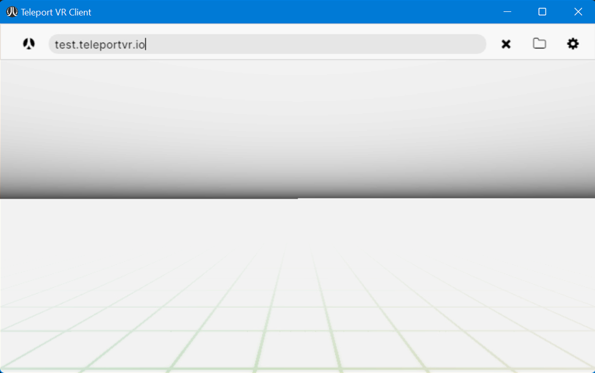

Client
######

The "Reference" Teleport Client application is available for Windows PC (with optional XR support),
and Meta Quest headsets. It's available from https://teleportvr.io/downloads.

On launching the client, you will be presented with an address bar. In desktop mode, this will appear
at the top of the window, just as in a web browser.

	
	The desktop PC Client has an address bar and connect button at the top.

In XR mode, it will float in front of you, atop a
virtual keyboard for typing. You can connect to any Teleport server by entering its address here and clicking
the connect button.

	
	The desktop PC Client has a virtual keyboard, with an address bar and connect button.

In XR mode, the address bar disappears when the connection is accepted. You can recall the address bar
by clicking the default "Menu" button for your XR device.

Most XR devices have one or two buttons that are reserved for special functions, like the Menu button or the "Meta" button on the Quest controller.
All other inputs, including headset and handset motion and other trackers, are mapped according to the Teleport
server's particular setup. Their functions will change, depending on the app you're connected to.

This is distinct from many other online XR systems. Two different Teleport servers are not two distinct
"levels", "worlds" or "locations" for a single application. They are two different apps.
