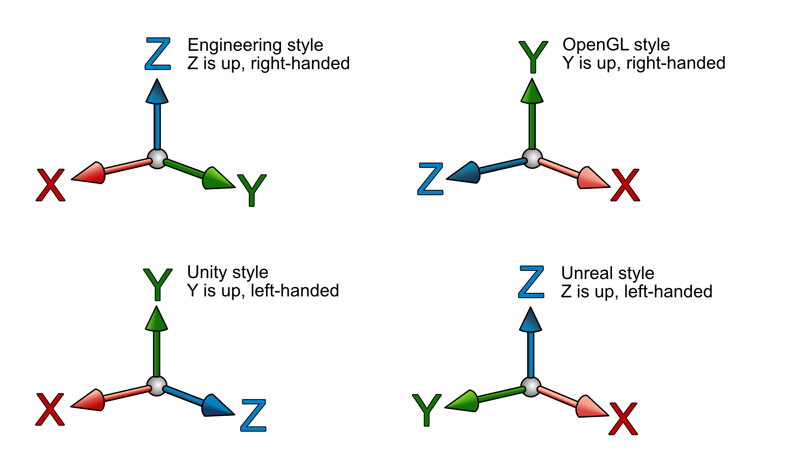

.. _server:

Server
======

Introduction
------------

TeleportServer is a library that provides server functionality in conjunction with a real-time game or simulation engine. The library is usually dynamically-linked, and can be controlled from engine-side
entirely by means of the functions that the dll exports. Therefore there is no need to include C++ headers from the server library engine-side, and indeed the engine need not be in C++.

API
---

The server library's exported functions are described below. These global functions are declared as exports.

Preparation
~~~~~~~~~~~

In order to start a server session, it's necessary to prepare the data - objects and resources - so it is ready to be streamed to connecting clients.
On the engine side there will often be a user interface for this - see for example 

.. doxygenfunction:: Server_StoreNode

.. doxygenfunction:: Server_RemoveNode

.. doxygenfunction:: Server_GetNode

.. doxygenfunction:: Server_StoreSkeleton

.. doxygenfunction:: Server_StoreTransformAnimation

.. doxygenfunction:: Server_StoreMesh

.. doxygenfunction:: Server_StoreMaterial

.. doxygenfunction:: Server_StoreTexture

.. doxygenfunction:: Server_StoreFont

.. doxygenfunction:: Server_StoreTextCanvas

.. doxygenfunction:: Server_GetFontAtlas

.. doxygenfunction:: Server_StoreShadowMap

.. doxygenfunction:: Server_IsNodeStored

.. doxygenfunction:: Server_IsSkeletonStored

.. doxygenfunction:: Server_IsMeshStored

.. doxygenfunction:: Server_IsMaterialStored

.. doxygenfunction:: Server_IsTextureStored

Lifecycle
~~~~~~~~~

.. mermaid::

	flowchart TD
		subgraph MainInitialization
			A(Server_Teleport_Initialize)
		end
		subgraph MainLoop
			B(Server_Tick)
		end
		subgraph EndSession
			C(Server_Teleport_Shutdown)
		end
		MainInitialization --> MainLoop("Main Loop")
		MainLoop --> EndSession
		MainLoop ---> MainLoop

The lifecycle of a server session is controlled by these functions: 

.. doxygenfunction:: Server_Teleport_Initialize

.. doxygenstruct:: teleport::server::InitializationSettings
	:members:

.. doxygenfunction:: Server_Teleport_Shutdown

.. doxygenfunction:: Server_Tick

.. doxygenfunction:: Server_EditorTick

.. doxygenfunction:: Server_Teleport_GetSessionState

State Management
~~~~~~~~~~~~~~~~

.. doxygenfunction:: Server_GetUnlinkedClientID

.. doxygenfunction:: Server_GenerateUid

.. doxygenfunction:: Server_GetOrGenerateUid

.. doxygenfunction:: Server_PathToUid

.. doxygenfunction:: Server_UidToPath

.. doxygenfunction:: Server_EnsureResourceIsLoaded

.. doxygenfunction:: Server_EnsurePathResourceIsLoaded

.. doxygenfunction:: Server_SaveGeometryStore

.. doxygenfunction:: Server_CheckGeometryStoreForErrors

.. doxygenfunction:: Server_LoadGeometryStore

.. doxygenfunction:: Server_ClearGeometryStore

.. doxygenfunction:: Server_SetDelayTextureCompression

.. doxygenfunction:: Server_SetCompressionLevels

.. doxygenfunction:: Server_ResendNode

.. doxygenfunction:: Server_GetNumberOfTexturesWaitingForCompression

.. doxygenfunction:: Server_GetMessageForNextCompressedTexture

.. doxygenfunction:: Server_CompressNextTexture

Axis Conversions
~~~~~~~~~~~~~~~~
Various axis conventions are used in different applications, game engines and API's. The reference API defines  :any:`avs::AxesStandard` to represent the possible standards that can be used.

The API provides conversion functions to transform between axis systems
.. doxygenfunction:: Server_ConvertTransform

.. doxygenfunction:: Server_ConvertRotation

.. doxygenfunction:: Server_ConvertPosition

.. doxygenfunction:: Server_ConvertScale

.. doxygenfunction:: Server_ConvertAxis

Memory
~~~~~~
.. doxygenfunction:: Server_DeleteUnmanagedArray

.. doxygenfunction:: Server_SizeOf

Setting Properties
~~~~~~~~~~~~~~~~~~
.. doxygenfunction:: Server_UpdateServerSettings

.. doxygenfunction:: Server_SetCachePath

.. doxygenfunction:: Server_SetConnectionTimeout

Setting Delegates
~~~~~~~~~~~~~~~~~
.. doxygenfunction:: Server_SetClientStoppedRenderingNodeDelegate

.. doxygenfunction:: Server_SetClientStartedRenderingNodeDelegate

.. doxygenfunction:: Server_SetHeadPoseSetterDelegate

.. doxygenfunction:: Server_SetNewInputStateProcessingDelegate

.. doxygenfunction:: Server_SetNewInputEventsProcessingDelegate

.. doxygenfunction:: Server_SetDisconnectDelegate

.. doxygenfunction:: Server_SetProcessAudioInputDelegate

.. doxygenfunction:: Server_SetGetUnixTimestampDelegate

.. doxygenfunction:: Server_SetMessageHandlerDelegate

Video
~~~~~
.. doxygenfunction:: Server_GetVideoEncodeCapabilities

.. doxygenfunction:: Server_InitializeVideoEncoder

.. doxygenfunction:: Server_ReconfigureVideoEncoder

.. doxygenfunction:: Server_EncodeVideoFrame

Audio
~~~~~
.. doxygenfunction:: Server_SetAudioSettings

.. doxygenfunction:: Server_SendAudio

Classes
-------

.. doxygenclass:: teleport::server::AudioEncodePipeline
	:members:

.. doxygenclass:: teleport::server::AudioEncoder
	:members:

.. doxygenstruct:: teleport::server::ClientNetworkContext
	:members:

.. doxygenclass:: teleport::server::ClientData
	:members:

.. doxygenclass:: teleport::server::ClientManager
	:members:

.. doxygenclass:: teleport::server::ClientMessaging
	:members:

.. doxygenclass:: teleport::server::SignalingService
	:members:

.. doxygenclass:: teleport::server::GeometryEncoder
	:members:

.. doxygenclass:: teleport::server::GeometryStore
	:members:

.. doxygenclass:: teleport::server::GeometryStreamingService
	:members:

.. doxygenclass:: teleport::server::HTTPService
	:members:

.. doxygenclass:: teleport::server::DefaultHTTPService
	:members:

.. doxygenclass:: teleport::server::NetworkPipeline
	:members:

.. doxygenstruct:: teleport::server::ServerSettings
	:members:

.. doxygenclass:: teleport::server::SourceNetworkPipeline
	:members:

.. doxygenclass:: teleport::server::VideoEncodePipeline
	:members:

Networking
----------

.. mermaid::

	flowchart LR
		A(Video Queue) -->|1| H(Network Sink)
		B(Tag Queue) -->|2| H
		C(Audio Queue) -->|3| H
		D(Geometry Queue) -->|4| H
		E(Command Queue) -->|5| H
		F(Geometry Encoder) --> D