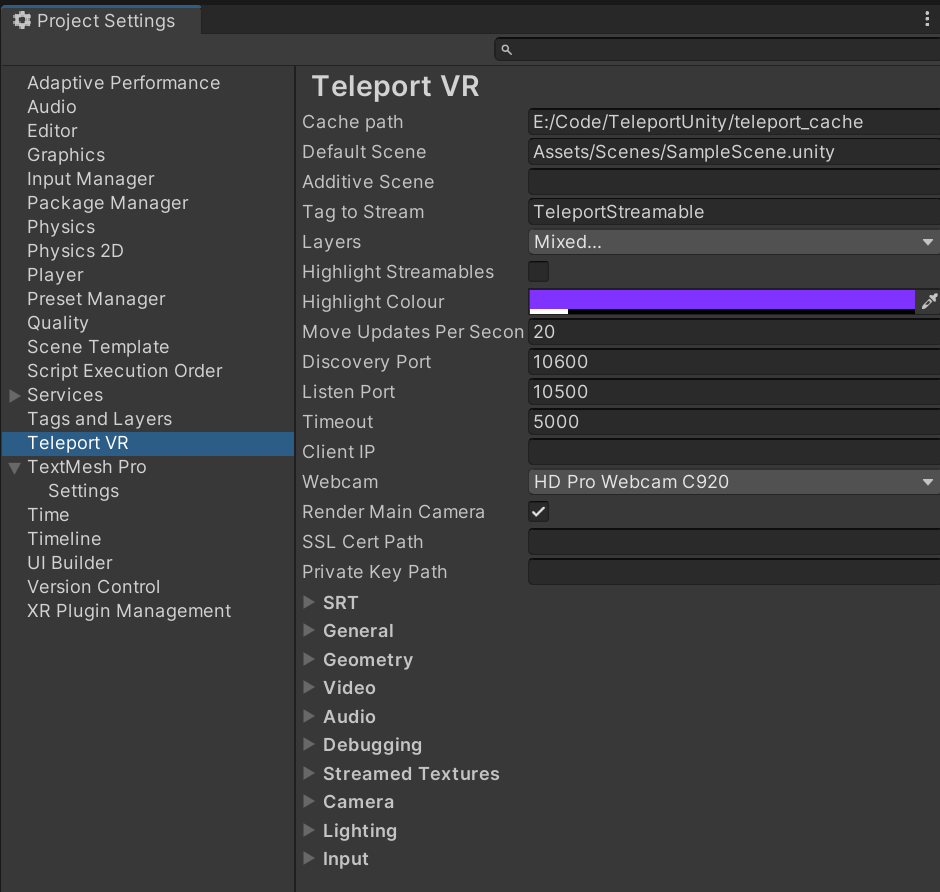

##################
Teleport Unity SDK
##################

The Teleport Unity SDK provides everything necessary to run a Teleport server as a Unity application. In typical usage, only the server need run Unity - the client
will be a standard Teleport client app such as the Teleport reference client.

Usage
*****

Installation
************
Get the Teleport Unity plugin from its Git repo at `git@github.com:simul/teleport-unity.git <https://github.com/simul/teleport-unity>`_.
Email contact@teleportvr.io to get free access to the repo.

From your unity project, launch the Package Manager, and install the Core RP Library.

You can install it as a Git submodule or just copy the code directly, it should go in a subfolder of your Unity project's Assets folder, e.g. Assets/Teleport.

Setup
*****
If you've installed the Teleport Unity SDK as a prebuilt package, you're ready to go. But if you're building the Teleport C++ Server SDK from source, you'll need to follow the instructions in the Server section of this documentation.
You will want to use CMakeGui to set:

* TELEPORT_SERVER to true
* TELEPORT_UNITY to true
* TELEPORT_UNITY_EDITOR_DIR to the folder where Unity.exe resides.
* TELEPORT_UNITY_PLUGINS_DIR to the folder Plugins/x86_64 in the Teleport Unity assets folder, so that the C++ SDK will build TeleportServer.dll to that directory.
* TELEPORT_UNITY_PROJECT_DIR to the root folder of your Unity project.

Then build the Teleport_Server_Unity.sln solution. You can run Unity as normal, or debug the C++ code by setting TeleportServer as the active C++ project in the solution, and launching it for debugging.

Configuration
*************
The global settings for the plugin are found in the *Edit* menu, under *Project Settings...*. In the Project Settings panel, select *Teleport VR*.

Usage
*****
You can create a GameObject in Unity that has the Monitor component. If not, one will be created when you run the project.

When running, the server awaits connections via the Teleport protocol. When a client connects, the server creates a player instance.

.. default-domain:: sphinxsharp
.. type:: public class teleport.Monitor
.. end-type::
.. type:: public class Example
.. end-type::
